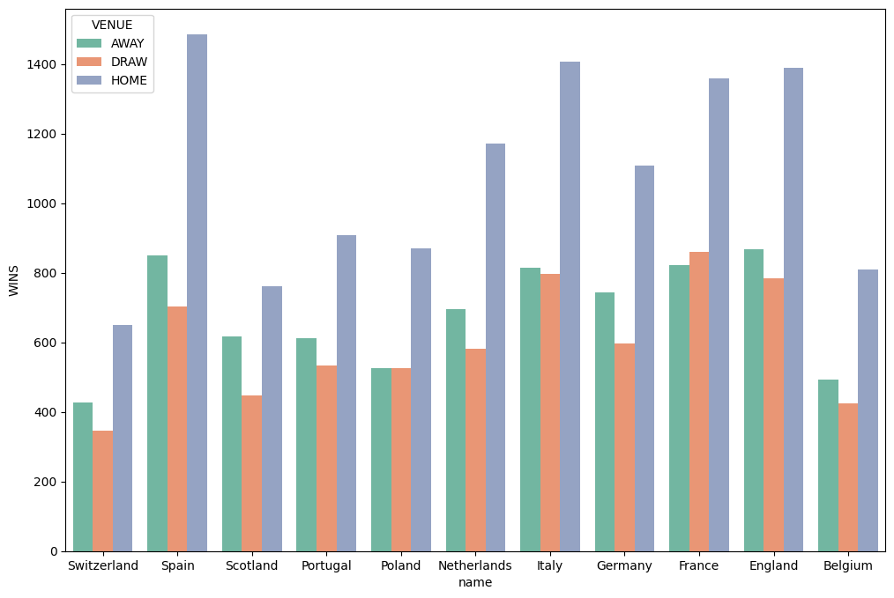
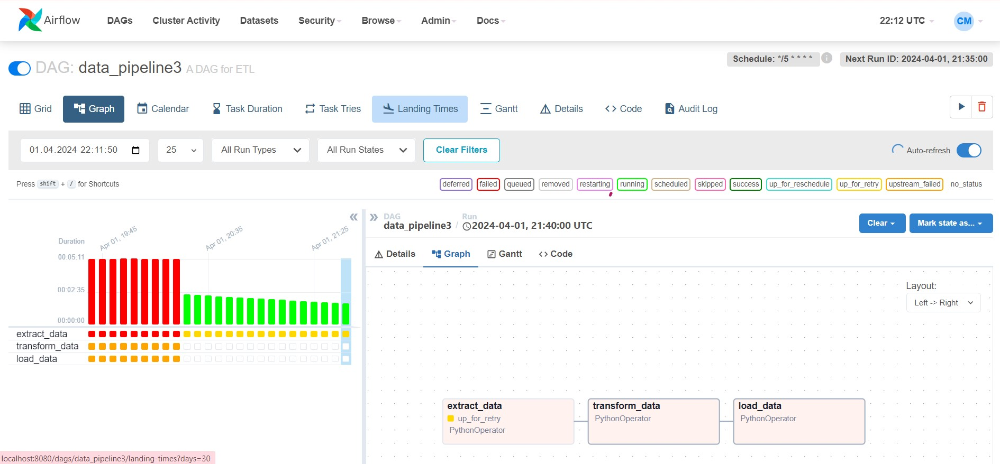

## sudo install apache-airflow
I love pipelines and discovering new knowledge! So here is how I run ETL pipeline on Airflow from scretch.

Three days were spent on understanding dependencies with Python script versions - not fun at all, but really useful. Now I configure almost everything through the Ubuntu terminal. How did I ever live without this?!

So, having that huge database.sqlite from Kaggle (football stat research), packed with insights about teams and players from various sports leagues, I thought, "Why not take it up a notch and build a slick ETL pipeline from scratch?"

First stop: extracting data. I got my hands on this nifty code snippet [here](https://gist.github.com/Christymacarena/399c40828e1041d0188ac103a8c19564). Usually, when I'm at home, I code with Google Colab ~~because there are kittens~~ because it visualizes really nice graphs and plots fast'n'easy. Check out the entropy I built to see which league is more predictable via values of odds coefficients provided ['B365H','B365D','B365A'].
## entropy league in football
enthropy line plot.png
Or this proof-on-data of theory that all teams play home better than away.

But it's not the same to code for dashboards or for data engineering processes. So, I discovered Spider (highly recommended), and from the third attempt, the DAG ran without any issues.

Next, I ventured into the realm of setting up the virtual environments. Diving headfirst into the vast ocean of Apache Airflow documentation, I even indulged in not one, but TWO LinkedIn Learning video courses. And after three attempts, here we go with DAG [data_pipeline3.py](data_pipeline3.ipynb).

Airflow now gracefully glides on port 8080. I'll keep you informed :)

From zero to hero, small steps to data engineering. 💻

Stay tuned for more tales from the data trenches!
